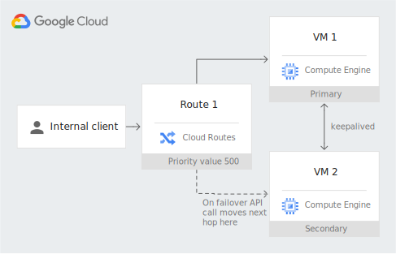

# Deploying the pattern using a heartbeat mechanism to switch a route's next hop

This document provides instructions on how to deploy the example implementation of the pattern using a heartbeat mechanism to switch a route's next hop as part of [Patterns for using floating IP addresses in Compute Engine](https://cloud.google.com/architecture/patterns-for-using-floating-ip-addresses-in-compute-engine#using_a_heartbeat_mechanism_to_switch_a_routes_next_hop) using [Terraform](https://www.terraform.io/).

This pattern deploys two [nginx](https://nginx.org/en/) webservers utilizing a floating IP address. When you request the document root (/) from the floating IP address (the IP address of the internal TCP/UDP load balancer) you receive a response that identifies the first or second web server.

The following diagram shows the architecture that you deploy. It consists of two Compute Engine instances running nginx. It also contains a static VPC route with the floating IP address as a destination and the primary instance as a next hop. `keepalived` is running on the nginx instances. When `keepalived` on the secondary instance detects a failure of the primary instance, it calls a Cloud function that updates the static VPC route to use the secondary instance as the next hop.



## Objectives
Provision the following resources in Google Cloud by using a Terraform template:
* One VPC network and subnetwork that connects all resources
* Two Compute Engine instances running nginx 
* A Compute Engine instance used as an internal client
* A set of firewall rules to allow the client VM to reach the nginx instances using HTTP, to allow VRRP for keepalived between the nginx instances and to allow connecting by using [SSH through IAP](https://cloud.google.com/iap/docs/using-tcp-forwarding#tunneling_ssh_connections)
* A routes using the floating IP address as destination and the primary nginx instance as next hop.
* A Google Cloud Function that dynamically updates the route and is called when `keepalived` notices a state change 
* A Cloud Storage bucket and an object containing the code for the function

## Costs
This tutorial uses billable components of Google Cloud:
* [Compute Engine](https://cloud.google.com/compute/all-pricing)
* [Virtual Private Cloud](https://cloud.google.com/vpc/network-pricing#vpc-pricing)
* [Cloud Functions](https://cloud.google.com/functions/pricing)
* [Cloud Storage](https://cloud.google.com/storage/pricing)
* [Cloud Build](https://cloud.google.com/build/pricing)

To generate a cost estimate based on your projected usage, use the [pricing calculator](https://cloud.google.com/products/calculator).

When you finish this tutorial, you can avoid continued billing by deleting the resources you created. For more information, see [Cleaning up](#Cleaning-up).

## Before you begin

1. In the Google Cloud Console, on the [project selector page](https://console.cloud.google.com/projectselector2/home/dashboard), select or create a Google Cloud project.

1. Make sure that billing is enabled for your Cloud project. Learn [how to confirm that billing is enabled for your project](https://cloud.google.com/billing/docs/how-to/modify-project#confirm_billing_is_enabled_on_a_project).

## Prepare your environment
You can complete this tutorial using [Cloud Shell](https://cloud.google.com/shell/docs) or your local host. Cloud Shell has Terraform pre-installed and set up to authenticate with Google Cloud.

1. (Optional) [Activate Cloud Shell](https://console.cloud.google.com/?cloudshell=true).

1. If you don't use Cloud Shell, install the required components unless they are already installed on your local host:

   * [Install Terraform](https://learn.hashicorp.com/tutorials/terraform/install-cli) version 0.15.0 or later.

   * [Install Google Cloud SDK](https://cloud.google.com/sdk/docs/install).

1. Authenticate to Google Cloud by running `gcloud auth application-default login`. Alternatively use a service account as described in the [Terraform Google provider documentation](https://registry.terraform.io/providers/hashicorp/google/latest/docs/guides/provider_reference#authentication).

1. If not already done, clone this repository to your local host or Cloud Shell by running `git clone https://github.com/GoogleCloudPlatform/floating-ip-patterns.git`.

## Configuring the Terraform variables
The Terraform code that you downloaded includes variables that you can use to customize the deployment based on your requirements. For example, you can adjust the subnet CIDR ranges and specify the project where the resources should be deployed.

You can see the variables of this example in the `variables.tf` file or in the [following table](#variables).

1. In the code that you downloaded, enter the `6-routes-keepalived` subdirectory: `cd floating-ip-patterns/6-routes-keepalived`.

1. Identify the variables for which you need to assign values:

   * Variables that don't have a default value (for example, `project_id`).
   * Variables with a default value that you want to change.

      For example, `region` and `zone` are set to deploy all resources in the `us-central1-c` zone by default, but you can deploy in a [region of your choice](https://cloud.google.com/compute/docs/regions-zones).

1. Create a text file named `terraform.tfvars`.

   Terraform treats any file with this extension as a [variable definitions file](https://www.terraform.io/docs/language/values/variables.html#variable-definitions-tfvars-files).

   If you don't create a `terraform.tfvars` or `.tfvars.json` file, Terraform uses the default values of the variables, if available. For variables that don't have a default value, Terraform prompts you to enter a value every time you run any Terraform command.

1. In the `terraform.tfvars`  file, assign appropriate values to the variables that you identified earlier.

   Example:
   ```
   region = "europe-west4"
   zone = "europe-west4-c"
   project_id = "my_project"
   vrrp_password = "mysecretpassword"
   ```
   The value that you assign to each variable must match the type of that variable as declared in `variables.tf` or [the following table](#Variables).
1. Initialize Terraform:
   ```
   terraform init
   ```
   Wait until you see the following message:
   ```
   Terraform has been successfully initialized!
   ```
1. Verify that the configuration has no errors:
   ```
   terraform validate
   ```
   If the command returns an error, make the required corrections in the configuration, and run `terraform validate` again.

   Repeat this step until the command returns the following message:
   ```
   Success! The configuration is valid.
   ```
1. Review the resources defined in the configuration:
   ```
   terraform plan
   ```
   The output lists the resources that Terraform provisions when you apply the configuration.

   If you want to make any changes, edit the configuration, and then run `terraform validate` and `terraform plan` again.
## Provisioning resources
When no further changes are necessary in the configuration, deploy the resources:

1. Run the following command:
   ```
   terraform apply
   ```
   Terraform displays a list of the resources that will be created.
1. At the prompt to perform the actions, enter `yes`.

   Terraform displays messages showing the progress of the deployment. After all the resources are created, Terraform displays the following message:
   ```
   Apply complete!
   ```

You have now deployed the example implementation for the the pattern that uses a heartbeat mechanism to switch a route's next hop.

## Testing your deployment
1. In your browser, go to the [VM instances](https://console.cloud.google.com/compute/instances) page for your project in the Google Cloud Console.
1. In the list of virtual machine instances, click *SSH* in the row of the instance named `client`.
   A separate window is opened that connects to the example client VM for this deployment.
1. On the client VM, run:
   ```
   curl 10.200.1.1
   ```
   If you changed the `floating_ip` variable in your Terraform variables file, replace `10.200.1.1` with the floating IP address you have chosen.

   You should see `This is server 1` as the primary instance serves all requests.
1. If you run the `curl` command repeatedly you can see that requests all requests are served by the primary instance.

Optionally, to test a failure case:
1. In the list of virtual machine instances, click *SSH* in the row of the instance with the name  `nginx-primary`
1. On the `nginx-primary` VM, stop the `nginx` service by running:
   ```
   sudo service nginx stop
   ```
1. After a few seconds, run the `curl` command from above repeatedly on the `client` instance and all requests should return `This is server 2`. The static route now points to the secondary instance.
## Adding, changing or removing resources
To add, change, or remove resources, edit the Terraform configuration, and then run the commands `terraform validate`, `terraform plan`, and `terraform apply`, in that order.


## Cleaning up
To avoid incurring charges to your Google Cloud account for the resources you created in this tutorial, delete all the resources when you don't need them.

1. Run the following command:
   ```
   terraform destroy
   ```
   Terraform displays a list of the resources that will be destroyed.

1. At the prompt to perform the actions, enter `yes`.

   Terraform displays messages showing the progress. After all the resources are deleted, Terraform displays the following message:
   ```
   Destroy complete!
   ```

## Variables


| Name | Description | Type | Default | Required |
|------|-------------|------|---------|:--------:|
| <a name="input_floating_ip"></a> [floating\_ip](#input\_floating\_ip) | Floating IP address | `string` | `"10.200.1.1"` | no |
| <a name="input_network_name"></a> [network\_name](#input\_network\_name) | VPC Network name | `string` | `"ip-failover"` | no |
| <a name="input_primary_ip"></a> [primary\_ip](#input\_primary\_ip) | IP address of the primary VM instance | `string` | `"10.100.2.1"` | no |
| <a name="input_project_id"></a> [project\_id](#input\_project\_id) | Google Cloud Project ID | `string` | n/a | yes |
| <a name="input_region"></a> [region](#input\_region) | Google Cloud Region used to deploy resources | `string` | `"us-central1"` | no |
| <a name="input_route_name"></a> [route\_name](#input\_route\_name) | Route name used for the floating IP route | `string` | `"floating-ip-route"` | no |
| <a name="input_secondary_ip"></a> [secondary\_ip](#input\_secondary\_ip) | IP address of the backup VM instance | `string` | `"10.100.2.2"` | no |
| <a name="input_subnet_name"></a> [subnet\_name](#input\_subnet\_name) | VPC Network name | `string` | `"ip-failover-subnet"` | no |
| <a name="input_subnet_range"></a> [subnet\_range](#input\_subnet\_range) | IP address range used for the subnet | `string` | `"10.100.0.0/16"` | no |
| <a name="input_vrrp_password"></a> [vrrp\_password](#input\_vrrp\_password) | Password used for VRRP between instances | `any` | n/a | yes |
| <a name="input_zone"></a> [zone](#input\_zone) | Google Cloud Zone used to deploy resources | `string` | `"us-central1-c"` | no |
